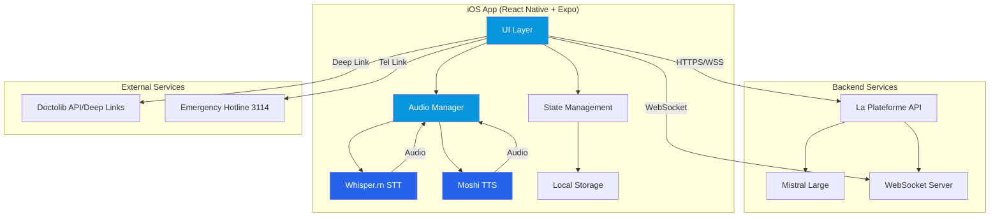

# Design Document: EquiLib iOS App

## Overview

EquiLib is a voice-first mental health navigation iOS application that helps users aged 22-45 navigate the French healthcare system. The app uses AI-powered conversation to understand user concerns, perform intelligent triage, and connect users with appropriate mental health practitioners via Doctolib integration.

### Core Technologies

- **Frontend Framework**: Expo + React Native (iOS-focused)
- **Speech-to-Text**: Whisper.cpp via whisper.rn (on-device processing)
- **Large Language Model**: Mistral Large via La Plateforme API
- **Text-to-Speech**: Moshi (Kyutai TTS)
- **Audio Processing**: expo-av
- **Real-time Communication**: WebSocket for streaming
- **Design System**: Doctolib-inspired professional medical interface

### Design Principles

1. **Voice-First**: Prioritize voice interaction with visual feedback
2. **Privacy-First**: On-device STT, encrypted data, RGPD compliance
3. **Crisis-Aware**: Immediate detection and response to emergency situations
4. **Professional Medical UI**: Clean, trustworthy, Doctolib-style interface
5. **Performance**: Fast responses, smooth animations, 60fps interactions

## Architecture

### High-Level System Architecture



### Architectural Layers

#### 1. Presentation Layer
- React Native components with Doctolib-inspired design
- Voice wave animation during recording/playback
- Card-based layouts with Doctolib blue (#0596DE)
- Bottom tab navigation (Chat, Triage, Practitioners, Profile)

#### 2. Audio Processing Layer
- **Whisper.rn Integration**: On-device speech-to-text processing
- **Moshi TTS**: Text-to-speech for AI responses
- **expo-av**: Audio recording, playback, and session management
- **Audio Queue Management**: Handle concurrent recording/playback

#### 3. Business Logic Layer
- **Conversation Manager**: Orchestrates AI dialogue flow
- **Triage Engine**: Analyzes conversation and generates recommendations
- **Crisis Detector**: Real-time monitoring for emergency indicators
- **Practitioner Matcher**: Filters and ranks healthcare providers

#### 4. Data Layer
- **Local Storage**: Encrypted conversation history, user preferences
- **Cache Layer**: Offline practitioner data, recent triage results
- **Secure Storage**: User authentication tokens, sensitive preferences

#### 5. Network Layer
- **WebSocket Client**: Streaming LLM responses
- **REST API Client**: Triage analysis, practitioner search
- **Connection Manager**: Retry logic, offline detection, timeout handling

## Components and Interfaces

### Core Components

#### 1. VoiceConversationScreen

Primary interface for user interaction with AI.

```typescript
interface VoiceConversationScreenProps {
  conversationId?: string;
  onTriageComplete: (result: TriageResult) => void;
}

interface ConversationState {
  messages: Message[];
  isRecording: boolean;
  isProcessing: boolean;
  isSpeaking: boolean;
  waveformData: number[];
  conversationTone: 'supportive' | 'direct';
}
```

**Responsibilities:**
- Display wave animation during voice input
- Manage recording state with expo-av
- Send audio to Whisper.rn for transcription
- Display conversation history
- Stream AI responses via WebSocket
- Trigger TTS playback for AI responses
- Detect crisis situations in real-time

**Key Sub-components:**
- `WaveformVisualizer`: Animated wave during recording/speaking
- `MessageBubble`: Chat message display (user/AI)
- `VoiceButton`: Record/stop control with visual feedback
- `CrisisAlert`: Emergency overlay when crisis detected

#### 2. TriageResultScreen

Displays AI-generated triage analysis and recommendations.

```typescript
interface TriageResult {
  id: string;
  timestamp: Date;
  primaryConcern: string;
  domain: 'psychological' | 'somatic' | 'professional';
  severityLevel: number; // 1-10
  recommendedSpecialist: string;
  summary: string;
  conversationId: string;
}

interface TriageResultScreenProps {
  result: TriageResult;
  onViewPractitioners: () => void;
}
```

**Responsibilities:**
- Display triage results in card format
- Show medical disclaimer prominently
- Display emergency hotline number
- Navigate to practitioner recommendations
- Allow user to save or share results

#### 3. PractitionerListScreen

Shows filtered and ranked mental health practitioners.

```typescript
interface Practitioner {
  id: string;
  name: string;
  specialty: string;
  photo: string;
  rating: number;
  distance: number; // km
  address: string;
  availabilityStatus: 'available' | 'limited' | 'unavailable';
  nextAvailableSlot?: Date;
  doctolibUrl: string;
}

interface PractitionerListScreenProps {
  triageResult: TriageResult;
  userLocation: Location;
}

interface PractitionerFilters {
  specialty?: string[];
  maxDistance?: number;
  availabilityOnly: boolean;
}
```

**Responsibilities:**
- Display practitioner cards with key information
- Apply filters (specialty, distance, availability)
- Sort by rating, distance, availability
- Handle practitioner selection
- Redirect to Doctolib with pre-filled parameters

#### 4. AudioManager

Centralized audio processing service.

```typescript
interface AudioManager {
  // Recording
  startRecording(): Promise<void>;
  stopRecording(): Promise<AudioRecording>;
  getWaveformData(): number[];
  
  // Transcription
  transcribeAudio(recording: AudioRecording): Promise<string>;
  
  // Playback
  playTTS(text: string): Promise<void>;
  stopPlayback(): void;
  
  // State
  isRecording: boolean;
  isPlaying: boolean;
  
  // Permissions
  requestMicrophonePermission(): Promise<boolean>;
}
```

**Responsibilities:**
- Manage expo-av audio sessions
- Interface with Whisper.rn for STT
- Interface with Moshi for TTS
- Provide real-time waveform data
- Handle audio interruptions (calls, notifications)

#### 5. ConversationEngine

Manages AI conversation flow and LLM integration.

```typescript
interface ConversationEngine {
  startConversation(tone: 'supportive' | 'direct'): Promise<string>;
  sendMessage(message: string): AsyncIterator<string>;
  endConversation(): Promise<TriageResult>;
  
  // Crisis detection
  onCrisisDetected: (callback: () => void) => void;
}

interface LLMMessage {
  role: 'user' | 'assistant' | 'system';
  content: string;
  timestamp: Date;
}
```

**Responsibilities:**
- Maintain conversation context
- Stream responses from Mistral Large via WebSocket
- Adapt conversation tone based on user preference
- Trigger crisis detection on each message
- Generate triage analysis after 3-5 exchanges

#### 6. CrisisDetector

Real-time monitoring for emergency situations.

```typescript
interface CrisisDetector {
  analyzeMessage(message: string): CrisisAnalysis;
  
  // Patterns
  detectSuicidalIdeation(text: string): boolean;
  detectSelfHarm(text: string): boolean;
  detectViolence(text: string): boolean;
}

interface CrisisAnalysis {
  isCrisis: boolean;
  confidence: number;
  indicators: string[];
  recommendedAction: 'emergency' | 'urgent' | 'standard';
}
```

**Responsibilities:**
- Analyze user messages for crisis indicators
- Trigger immediate emergency response
- Log crisis events securely
- Display emergency hotline (3114)

#### 7. TriageSystem

Analyzes conversation and generates recommendations.

```typescript
interface TriageSystem {
  analyzeConversation(messages: LLMMessage[]): Promise<TriageResult>;
  
  classifyDomain(messages: LLMMessage[]): 'psychological' | 'somatic' | 'professional';
  assessSeverity(messages: LLMMessage[]): number;
  recommendSpecialist(domain: string, severity: number): string;
}
```

**Responsibilities:**
- Process conversation history
- Classify concern domain
- Assign severity level (1-10)
- Recommend specialist type
- Generate user-friendly summary

#### 8. PractitionerRecommender

Matches users with appropriate healthcare providers.

```typescript
interface PractitionerRecommender {
  findPractitioners(
    specialistType: string,
    location: Location,
    filters: PractitionerFilters
  ): Promise<Practitioner[]>;
  
  rankPractitioners(
    practitioners: Practitioner[],
    criteria: RankingCriteria
  ): Practitioner[];
}

interface RankingCriteria {
  prioritizeRating: number; // 0-1 weight
  prioritizeDistance: number; // 0-1 weight
  prioritizeAvailability: number; // 0-1 weight
}
```

**Responsibilities:**
- Query practitioner database/API
- Filter by specialist type and location
- Rank by rating, distance, availability
- Return top 3 recommendations


### Navigation Structure

```typescript
type RootStackParamList = {
  Onboarding: undefined;
  MainTabs: undefined;
  TriageResult: { resultId: string };
  PractitionerDetail: { practitionerId: string };
  BookingConfirmation: { practitionerId: string };
  CrisisEmergency: undefined;
};

type MainTabParamList = {
  Chat: undefined;
  Triage: undefined;
  Practitioners: { triageResultId?: string };
  Profile: undefined;
};
```

### UI Component Library

#### Design Tokens

```typescript
const Colors = {
  // Primary
  doctolibBlue: '#0596DE',
  deepNightBlue: '#0A1628',
  electricBlue: '#2563EB',
  
  // Neutrals
  white: '#FFFFFF',
  gray50: '#F9FAFB',
  gray100: '#F3F4F6',
  gray200: '#E5E7EB',
  gray700: '#374151',
  gray900: '#111827',
  
  // Semantic
  success: '#10B981',
  warning: '#F59E0B',
  error: '#EF4444',
  crisis: '#DC2626',
};

const Typography = {
  h1: { fontSize: 32, fontWeight: '700', lineHeight: 40 },
  h2: { fontSize: 24, fontWeight: '600', lineHeight: 32 },
  h3: { fontSize: 20, fontWeight: '600', lineHeight: 28 },
  body: { fontSize: 16, fontWeight: '400', lineHeight: 24 },
  bodyBold: { fontSize: 16, fontWeight: '600', lineHeight: 24 },
  caption: { fontSize: 14, fontWeight: '400', lineHeight: 20 },
  small: { fontSize: 12, fontWeight: '400', lineHeight: 16 },
};

const Spacing = {
  xs: 4,
  sm: 8,
  md: 16,
  lg: 24,
  xl: 32,
  xxl: 48,
};

const BorderRadius = {
  sm: 8,
  md: 12,
  lg: 16,
  full: 9999,
};
```

#### Reusable Components

**Card Component**
```typescript
interface CardProps {
  children: React.ReactNode;
  variant: 'default' | 'elevated' | 'outlined';
  padding?: keyof typeof Spacing;
  onPress?: () => void;
}
```

**Button Component**
```typescript
interface ButtonProps {
  title: string;
  variant: 'primary' | 'secondary' | 'outline' | 'ghost' | 'crisis';
  size: 'sm' | 'md' | 'lg';
  icon?: React.ReactNode;
  loading?: boolean;
  disabled?: boolean;
  onPress: () => void;
}
```

**WaveformVisualizer Component**
```typescript
interface WaveformVisualizerProps {
  isActive: boolean;
  waveformData: number[];
  color: string;
  height: number;
}
```

## Data Models

### User Profile

```typescript
interface UserProfile {
  id: string;
  createdAt: Date;
  location: Location;
  conversationTone: 'supportive' | 'direct';
  preferences: UserPreferences;
}

interface Location {
  latitude: number;
  longitude: number;
  city: string;
  postalCode: string;
}

interface UserPreferences {
  voiceEnabled: boolean;
  ttsEnabled: boolean;
  darkMode: boolean;
  notificationsEnabled: boolean;
}
```

### Conversation

```typescript
interface Conversation {
  id: string;
  userId: string;
  startedAt: Date;
  completedAt?: Date;
  tone: 'supportive' | 'direct';
  messages: Message[];
  triageResultId?: string;
  status: 'active' | 'completed' | 'abandoned' | 'crisis';
}

interface Message {
  id: string;
  conversationId: string;
  role: 'user' | 'assistant';
  content: string;
  timestamp: Date;
  audioUrl?: string; // For voice messages
  transcription?: string; // For voice messages
}
```

### Triage Result

```typescript
interface TriageResult {
  id: string;
  conversationId: string;
  userId: string;
  timestamp: Date;
  
  // Classification
  primaryConcern: string;
  domain: 'psychological' | 'somatic' | 'professional';
  severityLevel: number; // 1-10
  
  // Recommendations
  recommendedSpecialist: string;
  summary: string;
  actionItems: string[];
  
  // Metadata
  confidence: number;
  requiresUrgentCare: boolean;
}
```

### Practitioner

```typescript
interface Practitioner {
  id: string;
  name: string;
  firstName: string;
  lastName: string;
  
  // Professional info
  specialty: string;
  specialties: string[];
  credentials: string[];
  languages: string[];
  
  // Contact
  phone: string;
  email: string;
  website?: string;
  doctolibUrl: string;
  
  // Location
  address: Address;
  location: Location;
  
  // Ratings
  rating: number;
  reviewCount: number;
  
  // Availability
  availabilityStatus: 'available' | 'limited' | 'unavailable';
  nextAvailableSlot?: Date;
  acceptsNewPatients: boolean;
  
  // Media
  photo: string;
  profileDescription: string;
}

interface Address {
  street: string;
  city: string;
  postalCode: string;
  country: string;
}
```

### Crisis Event

```typescript
interface CrisisEvent {
  id: string;
  userId: string;
  conversationId: string;
  timestamp: Date;
  
  // Detection
  triggerMessage: string;
  indicators: string[];
  confidence: number;
  
  // Response
  emergencyDisplayed: boolean;
  userCalledHotline: boolean;
  
  // Privacy: Encrypted at rest
  encrypted: boolean;
}
```

## API Integrations

### Mistral Large via La Plateforme API

#### Conversation Streaming

```typescript
// WebSocket connection for streaming responses
const wsUrl = 'wss://api.mistral.ai/v1/chat/stream';

interface MistralStreamRequest {
  model: 'mistral-large-latest';
  messages: LLMMessage[];
  temperature: number;
  max_tokens: number;
  stream: true;
}

interface MistralStreamChunk {
  id: string;
  object: 'chat.completion.chunk';
  created: number;
  model: string;
  choices: [{
    index: number;
    delta: {
      role?: string;
      content?: string;
    };
    finish_reason: string | null;
  }];
}
```

**Implementation:**
- Establish WebSocket connection on conversation start
- Send user messages with full conversation context
- Stream response chunks and update UI in real-time
- Handle connection errors with retry logic
- Close connection on conversation end

#### Triage Analysis

```typescript
// REST API call for triage analysis
const triageEndpoint = 'https://api.mistral.ai/v1/chat/completions';

interface TriageRequest {
  model: 'mistral-large-latest';
  messages: LLMMessage[];
  temperature: 0.3; // Lower for more consistent analysis
  response_format: { type: 'json_object' };
}

interface TriageResponse {
  domain: 'psychological' | 'somatic' | 'professional';
  severity: number;
  specialist: string;
  summary: string;
  confidence: number;
}
```

### Whisper.rn (On-Device STT)

```typescript
import { WhisperContext } from 'whisper.rn';

interface WhisperConfig {
  model: 'tiny' | 'base' | 'small' | 'medium' | 'large';
  language: 'fr'; // French
  translate: false;
}

// Initialize Whisper context
const whisperContext = await WhisperContext.initialize({
  filePath: 'path/to/ggml-model.bin',
});

// Transcribe audio
const transcription = await whisperContext.transcribe(audioFilePath, {
  language: 'fr',
  maxLen: 1,
  tokenTimestamps: false,
});
```

**Model Selection:**
- Use `base` model for balance of speed and accuracy
- Model size: ~140MB
- Bundle with app or download on first launch
- French language optimization

### Moshi TTS (Kyutai)

```typescript
interface MoshiTTSConfig {
  voice: 'professional' | 'warm' | 'calm';
  speed: number; // 0.8 - 1.2
  language: 'fr';
}

interface MoshiTTSClient {
  synthesize(text: string, config: MoshiTTSConfig): Promise<AudioBuffer>;
  stream(text: string, config: MoshiTTSConfig): AsyncIterator<AudioChunk>;
}
```

**Implementation:**
- Stream TTS audio as it's generated
- Play audio chunks using expo-av
- Support pause/resume during playback
- Cache common phrases for faster response

### Doctolib Integration

#### Deep Link Structure

```typescript
const doctolibDeepLink = (practitioner: Practitioner, specialty: string) => {
  const baseUrl = 'https://www.doctolib.fr';
  const params = new URLSearchParams({
    speciality: specialty,
    'search[name]': practitioner.name,
    'search[city]': practitioner.address.city,
    'search[postal_code]': practitioner.address.postalCode,
  });
  
  return `${baseUrl}/search?${params.toString()}`;
};
```

**Fallback Strategy:**
- Primary: Deep link to Doctolib app if installed
- Secondary: Open Doctolib website in Safari
- Tertiary: Display practitioner contact information

#### Practitioner Data Source

**Option 1: Doctolib Public API (if available)**
- Query practitioners by specialty and location
- Get availability status
- Retrieve ratings and reviews

**Option 2: Custom Backend with Scraped Data**
- Maintain practitioner database
- Periodic updates from Doctolib
- Cache locally for offline access

**Option 3: Hybrid Approach**
- Static practitioner database bundled with app
- Real-time availability via API
- User location-based filtering

### Emergency Services Integration

```typescript
const emergencyHotline = {
  number: '3114',
  displayName: 'Numéro National de Prévention du Suicide',
  available: '24/7',
};

const callEmergency = () => {
  Linking.openURL(`tel:${emergencyHotline.number}`);
};
```

## UI/UX Design Patterns

### Voice-First Interaction Flow

```
1. User opens app → Wave animation idle state
2. User taps microphone → Wave animates (recording)
3. User speaks → Wave responds to audio levels
4. User releases → Wave transitions to processing
5. Transcription appears → User can edit
6. User confirms → Message sent
7. AI responds → Wave animates (speaking)
8. TTS plays → User listens
9. Cycle repeats
```

### Wave Animation States

```typescript
enum WaveState {
  Idle = 'idle',           // Gentle pulse
  Listening = 'listening', // Reactive to audio input
  Processing = 'processing', // Loading animation
  Speaking = 'speaking',   // Reactive to TTS output
  Error = 'error',         // Red pulse
}
```

**Animation Specifications:**
- 60fps smooth animation using React Native Reanimated
- Audio-reactive bars (8-12 bars)
- Color: Doctolib blue (#0596DE) for normal, red (#DC2626) for crisis
- Height range: 20px - 80px based on audio amplitude
- Transition duration: 200ms between states

### Card-Based Layouts

**Triage Result Card:**
```
┌─────────────────────────────────────┐
│ 🎯 Votre Orientation                │
│                                     │
│ Préoccupation principale:           │
│ [Primary Concern Text]              │
│                                     │
│ Spécialiste recommandé:             │
│ [Specialist Type]                   │
│                                     │
│ Niveau de priorité: ●●●●○○○○○○      │
│                                     │
│ [Voir les praticiens] [Sauvegarder] │
│                                     │
│ ⚠️ Ceci est une orientation, pas    │
│    un diagnostic médical            │
└─────────────────────────────────────┘
```

**Practitioner Card:**
```
┌─────────────────────────────────────┐
│ [Photo] Dr. [Name]                  │
│         [Specialty]                 │
│         ⭐ [Rating] ([Reviews])     │
│         📍 [Distance] km            │
│         🕐 Disponible [Date]        │
│                                     │
│         [Prendre RDV sur Doctolib]  │
└─────────────────────────────────────┘
```

### Crisis Detection UI

When crisis detected:
```
┌─────────────────────────────────────┐
│ 🚨 Aide Immédiate Disponible        │
│                                     │
│ Si vous êtes en danger immédiat,    │
│ contactez le:                       │
│                                     │
│ ┌─────────────────────────────────┐ │
│ │   📞 3114                       │ │
│ │   Numéro National de Prévention│ │
│ │   du Suicide                    │ │
│ │   [APPELER MAINTENANT]          │ │
│ └─────────────────────────────────┘ │
│                                     │
│ Disponible 24h/24, 7j/7             │
│                                     │
│ [Continuer la conversation]         │
└─────────────────────────────────────┘
```

### Onboarding Flow

**Screen 1: Welcome**
- App logo and name
- Brief description
- "Commencer" button

**Screen 2: Location**
- Map view
- Location permission request
- Manual city input fallback

**Screen 3: Conversation Tone**
- Two options with descriptions:
  - "Soutien" (Supportive): Empathetic, gentle
  - "Direct" (Direct): Concise, action-oriented
- Preview example for each

**Screen 4: Legal**
- Terms and conditions
- Privacy policy
- Medical disclaimer
- "J'accepte" button

### Accessibility Patterns

**VoiceOver Support:**
- All interactive elements have accessibility labels
- Wave animation has descriptive label: "Enregistrement en cours"
- Crisis alerts interrupt VoiceOver with high priority

**Dynamic Type:**
- All text scales with iOS text size settings
- Minimum touch target: 44x44 points
- Layout adapts to larger text sizes

**Color Contrast:**
- Primary text on white: 16:1 ratio
- Secondary text on white: 7:1 ratio
- Button text on Doctolib blue: 4.5:1 ratio

**Dark Mode:**
- Deep night blue background (#0A1628)
- White text with adjusted opacity
- Reduced brightness for wave animation


## Technical Implementation Details

### Audio Processing Pipeline

#### Recording Flow

```typescript
// 1. Initialize audio session
await Audio.setAudioModeAsync({
  allowsRecordingIOS: true,
  playsInSilentModeIOS: true,
  staysActiveInBackground: false,
  shouldDuckAndroid: true,
  playThroughEarpieceAndroid: false,
});

// 2. Start recording
const recording = new Audio.Recording();
await recording.prepareToRecordAsync({
  android: {
    extension: '.m4a',
    outputFormat: Audio.RECORDING_OPTION_ANDROID_OUTPUT_FORMAT_MPEG_4,
    audioEncoder: Audio.RECORDING_OPTION_ANDROID_AUDIO_ENCODER_AAC,
    sampleRate: 16000,
    numberOfChannels: 1,
    bitRate: 128000,
  },
  ios: {
    extension: '.wav',
    audioQuality: Audio.RECORDING_OPTION_IOS_AUDIO_QUALITY_HIGH,
    sampleRate: 16000,
    numberOfChannels: 1,
    bitRate: 128000,
    linearPCMBitDepth: 16,
    linearPCMIsBigEndian: false,
    linearPCMIsFloat: false,
  },
});

await recording.startAsync();

// 3. Get waveform data for visualization
recording.setOnRecordingStatusUpdate((status) => {
  if (status.isRecording) {
    const metering = status.metering || 0;
    updateWaveform(metering);
  }
});

// 4. Stop and get URI
await recording.stopAndUnloadAsync();
const uri = recording.getURI();
```

#### Transcription Flow

```typescript
// 1. Initialize Whisper context (once on app start)
const whisperContext = await WhisperContext.initialize({
  filePath: getWhisperModelPath('base'),
});

// 2. Transcribe audio file
const transcribeAudio = async (audioUri: string): Promise<string> => {
  try {
    const result = await whisperContext.transcribe(audioUri, {
      language: 'fr',
      maxLen: 1,
      tokenTimestamps: false,
      speedUp: false,
    });
    
    return result.result.trim();
  } catch (error) {
    console.error('Transcription error:', error);
    throw new Error('Échec de la transcription');
  }
};
```

#### TTS Playback Flow

```typescript
// 1. Synthesize speech from text
const audioBuffer = await moshiClient.synthesize(text, {
  voice: 'professional',
  speed: 1.0,
  language: 'fr',
});

// 2. Create sound object
const { sound } = await Audio.Sound.createAsync(
  { uri: audioBuffer.uri },
  { shouldPlay: true },
  onPlaybackStatusUpdate
);

// 3. Play with waveform visualization
sound.setOnPlaybackStatusUpdate((status) => {
  if (status.isLoaded && status.isPlaying) {
    // Update waveform based on playback position
    updateWaveformForPlayback(status.positionMillis, status.durationMillis);
  }
});

await sound.playAsync();
```

### State Management

Using React Context + useReducer for global state:

```typescript
interface AppState {
  user: UserProfile | null;
  currentConversation: Conversation | null;
  conversations: Conversation[];
  triageResults: TriageResult[];
  practitioners: Practitioner[];
  isOnline: boolean;
  audioState: AudioState;
}

interface AudioState {
  isRecording: boolean;
  isProcessing: boolean;
  isPlaying: boolean;
  waveformData: number[];
  currentTranscription: string;
}

type AppAction =
  | { type: 'SET_USER'; payload: UserProfile }
  | { type: 'START_CONVERSATION'; payload: Conversation }
  | { type: 'ADD_MESSAGE'; payload: Message }
  | { type: 'SET_TRIAGE_RESULT'; payload: TriageResult }
  | { type: 'UPDATE_AUDIO_STATE'; payload: Partial<AudioState> }
  | { type: 'SET_ONLINE_STATUS'; payload: boolean };

const appReducer = (state: AppState, action: AppAction): AppState => {
  switch (action.type) {
    case 'SET_USER':
      return { ...state, user: action.payload };
    case 'START_CONVERSATION':
      return { ...state, currentConversation: action.payload };
    case 'ADD_MESSAGE':
      return {
        ...state,
        currentConversation: {
          ...state.currentConversation!,
          messages: [...state.currentConversation!.messages, action.payload],
        },
      };
    // ... other cases
    default:
      return state;
  }
};
```

### Local Storage Strategy

Using `expo-secure-store` for sensitive data and `AsyncStorage` for general data:

```typescript
// Secure storage for sensitive data
import * as SecureStore from 'expo-secure-store';

const secureStorage = {
  async saveUserProfile(profile: UserProfile) {
    await SecureStore.setItemAsync('user_profile', JSON.stringify(profile));
  },
  
  async getUserProfile(): Promise<UserProfile | null> {
    const data = await SecureStore.getItemAsync('user_profile');
    return data ? JSON.parse(data) : null;
  },
  
  async saveCrisisEvent(event: CrisisEvent) {
    // Encrypt before storing
    const encrypted = await encryptData(JSON.stringify(event));
    await SecureStore.setItemAsync(`crisis_${event.id}`, encrypted);
  },
};

// AsyncStorage for non-sensitive data
import AsyncStorage from '@react-native-async-storage/async-storage';

const localStorage = {
  async saveConversations(conversations: Conversation[]) {
    await AsyncStorage.setItem('conversations', JSON.stringify(conversations));
  },
  
  async getConversations(): Promise<Conversation[]> {
    const data = await AsyncStorage.getItem('conversations');
    return data ? JSON.parse(data) : [];
  },
  
  async cachePractitioners(practitioners: Practitioner[]) {
    await AsyncStorage.setItem('practitioners_cache', JSON.stringify(practitioners));
  },
};
```

### WebSocket Connection Management

```typescript
class ConversationWebSocket {
  private ws: WebSocket | null = null;
  private reconnectAttempts = 0;
  private maxReconnectAttempts = 5;
  private messageQueue: string[] = [];
  
  connect(conversationId: string) {
    const wsUrl = `wss://api.mistral.ai/v1/chat/stream?conversation_id=${conversationId}`;
    
    this.ws = new WebSocket(wsUrl, {
      headers: {
        'Authorization': `Bearer ${API_KEY}`,
        'Content-Type': 'application/json',
      },
    });
    
    this.ws.onopen = () => {
      console.log('WebSocket connected');
      this.reconnectAttempts = 0;
      this.flushMessageQueue();
    };
    
    this.ws.onmessage = (event) => {
      const chunk: MistralStreamChunk = JSON.parse(event.data);
      this.handleStreamChunk(chunk);
    };
    
    this.ws.onerror = (error) => {
      console.error('WebSocket error:', error);
    };
    
    this.ws.onclose = () => {
      console.log('WebSocket closed');
      this.attemptReconnect();
    };
  }
  
  sendMessage(message: string) {
    if (this.ws?.readyState === WebSocket.OPEN) {
      this.ws.send(JSON.stringify({ message }));
    } else {
      this.messageQueue.push(message);
    }
  }
  
  private attemptReconnect() {
    if (this.reconnectAttempts < this.maxReconnectAttempts) {
      this.reconnectAttempts++;
      const delay = Math.min(1000 * Math.pow(2, this.reconnectAttempts), 10000);
      setTimeout(() => this.connect(this.conversationId), delay);
    }
  }
  
  private flushMessageQueue() {
    while (this.messageQueue.length > 0) {
      const message = this.messageQueue.shift();
      if (message) this.sendMessage(message);
    }
  }
  
  disconnect() {
    this.ws?.close();
    this.ws = null;
  }
}
```

### Crisis Detection Implementation

```typescript
class CrisisDetector {
  private crisisPatterns = {
    suicidal: [
      /je veux mourir/i,
      /envie de me suicider/i,
      /mettre fin à mes jours/i,
      /plus envie de vivre/i,
      /en finir/i,
    ],
    selfHarm: [
      /me faire du mal/i,
      /me blesser/i,
      /me couper/i,
      /automutilation/i,
    ],
    violence: [
      /faire du mal à quelqu'un/i,
      /envie de frapper/i,
      /tuer quelqu'un/i,
    ],
  };
  
  analyzeMessage(message: string): CrisisAnalysis {
    const indicators: string[] = [];
    let isCrisis = false;
    
    // Check suicidal ideation
    if (this.crisisPatterns.suicidal.some(pattern => pattern.test(message))) {
      indicators.push('suicidal_ideation');
      isCrisis = true;
    }
    
    // Check self-harm
    if (this.crisisPatterns.selfHarm.some(pattern => pattern.test(message))) {
      indicators.push('self_harm');
      isCrisis = true;
    }
    
    // Check violence
    if (this.crisisPatterns.violence.some(pattern => pattern.test(message))) {
      indicators.push('violence');
      isCrisis = true;
    }
    
    // Use LLM for nuanced detection
    const llmAnalysis = await this.llmCrisisCheck(message);
    
    return {
      isCrisis: isCrisis || llmAnalysis.isCrisis,
      confidence: llmAnalysis.confidence,
      indicators: [...indicators, ...llmAnalysis.indicators],
      recommendedAction: isCrisis ? 'emergency' : llmAnalysis.recommendedAction,
    };
  }
  
  private async llmCrisisCheck(message: string): Promise<CrisisAnalysis> {
    // Use Mistral Large for nuanced crisis detection
    const response = await fetch('https://api.mistral.ai/v1/chat/completions', {
      method: 'POST',
      headers: {
        'Authorization': `Bearer ${API_KEY}`,
        'Content-Type': 'application/json',
      },
      body: JSON.stringify({
        model: 'mistral-large-latest',
        messages: [
          {
            role: 'system',
            content: 'You are a crisis detection system. Analyze the message for signs of suicidal ideation, self-harm, or violence. Respond with JSON.',
          },
          {
            role: 'user',
            content: message,
          },
        ],
        response_format: { type: 'json_object' },
      }),
    });
    
    return await response.json();
  }
}
```

### Performance Optimization

#### Lazy Loading and Code Splitting

```typescript
// Lazy load heavy components
const PractitionerListScreen = lazy(() => import('./screens/PractitionerListScreen'));
const TriageResultScreen = lazy(() => import('./screens/TriageResultScreen'));

// Preload Whisper model on app start
useEffect(() => {
  const preloadWhisper = async () => {
    await WhisperContext.initialize({
      filePath: getWhisperModelPath('base'),
    });
  };
  
  preloadWhisper();
}, []);
```

#### Memoization

```typescript
// Memoize expensive computations
const sortedPractitioners = useMemo(() => {
  return rankPractitioners(practitioners, {
    prioritizeRating: 0.4,
    prioritizeDistance: 0.4,
    prioritizeAvailability: 0.2,
  });
}, [practitioners]);

// Memoize components
const MessageBubble = memo(({ message }: { message: Message }) => {
  return (
    <View style={styles.bubble}>
      <Text>{message.content}</Text>
    </View>
  );
});
```

#### Image Optimization

```typescript
// Use expo-image for optimized image loading
import { Image } from 'expo-image';

<Image
  source={{ uri: practitioner.photo }}
  placeholder={blurhash}
  contentFit="cover"
  transition={200}
  cachePolicy="memory-disk"
/>
```

### Error Handling Strategy

```typescript
class ErrorHandler {
  static handle(error: Error, context: string) {
    console.error(`Error in ${context}:`, error);
    
    // Log to error tracking service (e.g., Sentry)
    if (__DEV__) {
      console.error(error);
    } else {
      // Sentry.captureException(error, { tags: { context } });
    }
    
    // Show user-friendly message
    return this.getUserMessage(error);
  }
  
  static getUserMessage(error: Error): string {
    if (error.message.includes('network')) {
      return 'Problème de connexion. Veuillez vérifier votre connexion internet.';
    }
    
    if (error.message.includes('timeout')) {
      return 'La requête a pris trop de temps. Veuillez réessayer.';
    }
    
    if (error.message.includes('transcription')) {
      return 'Impossible de transcrire l\'audio. Veuillez réessayer ou utiliser le texte.';
    }
    
    return 'Une erreur est survenue. Veuillez réessayer.';
  }
}

// Usage in components
try {
  const transcription = await transcribeAudio(audioUri);
} catch (error) {
  const message = ErrorHandler.handle(error as Error, 'transcribeAudio');
  Alert.alert('Erreur', message);
}
```

### Offline Support

```typescript
// Network status monitoring
import NetInfo from '@react-native-community/netinfo';

const useNetworkStatus = () => {
  const [isOnline, setIsOnline] = useState(true);
  
  useEffect(() => {
    const unsubscribe = NetInfo.addEventListener(state => {
      setIsOnline(state.isConnected ?? false);
    });
    
    return () => unsubscribe();
  }, []);
  
  return isOnline;
};

// Offline queue for messages
class OfflineQueue {
  private queue: Message[] = [];
  
  async enqueue(message: Message) {
    this.queue.push(message);
    await AsyncStorage.setItem('offline_queue', JSON.stringify(this.queue));
  }
  
  async flush() {
    const messages = [...this.queue];
    this.queue = [];
    await AsyncStorage.removeItem('offline_queue');
    
    for (const message of messages) {
      await sendMessage(message);
    }
  }
  
  async restore() {
    const data = await AsyncStorage.getItem('offline_queue');
    if (data) {
      this.queue = JSON.parse(data);
    }
  }
}
```

### Security Implementation

#### Data Encryption

```typescript
import * as Crypto from 'expo-crypto';

const encryptData = async (data: string): Promise<string> => {
  const key = await getEncryptionKey();
  // Use AES-256-GCM encryption
  const encrypted = await Crypto.digestStringAsync(
    Crypto.CryptoDigestAlgorithm.SHA256,
    data + key
  );
  return encrypted;
};

const decryptData = async (encrypted: string): Promise<string> => {
  // Implement decryption logic
  // This is a simplified example
  return encrypted;
};
```

#### API Key Management

```typescript
// Store API keys in environment variables
const API_CONFIG = {
  mistralApiKey: process.env.EXPO_PUBLIC_MISTRAL_API_KEY,
  mistralApiUrl: 'https://api.mistral.ai/v1',
};

// Never log API keys
const sanitizeLog = (data: any) => {
  const sanitized = { ...data };
  if (sanitized.apiKey) sanitized.apiKey = '***';
  if (sanitized.authorization) sanitized.authorization = '***';
  return sanitized;
};
```

#### RGPD Compliance

```typescript
interface RGPDConsent {
  userId: string;
  consentDate: Date;
  dataProcessing: boolean;
  dataStorage: boolean;
  analytics: boolean;
}

const rgpdManager = {
  async recordConsent(consent: RGPDConsent) {
    await SecureStore.setItemAsync('rgpd_consent', JSON.stringify(consent));
  },
  
  async deleteUserData(userId: string) {
    // Delete all user data
    await SecureStore.deleteItemAsync('user_profile');
    await AsyncStorage.removeItem('conversations');
    await AsyncStorage.removeItem('triage_results');
    
    // Call backend to delete server-side data
    await fetch(`${API_URL}/users/${userId}`, { method: 'DELETE' });
  },
  
  async exportUserData(userId: string): Promise<any> {
    // Export all user data for RGPD data portability
    const profile = await secureStorage.getUserProfile();
    const conversations = await localStorage.getConversations();
    
    return {
      profile,
      conversations,
      exportDate: new Date().toISOString(),
    };
  },
};
```


## Correctness Properties

*A property is a characteristic or behavior that should hold true across all valid executions of a system—essentially, a formal statement about what the system should do. Properties serve as the bridge between human-readable specifications and machine-verifiable correctness guarantees.*

### Property Reflection

After analyzing all acceptance criteria, I identified the following redundancies and consolidations:

**Redundancy Analysis:**
- Properties 1.4 and 1.5 both test preference persistence - consolidated into a single round-trip property
- Properties 9.2 and 9.3 test similar preference update functionality - consolidated into a general preference update property
- Properties 3.6 and 13.2 both test disclaimer display on triage screens - consolidated
- Properties 4.2 and 4.3 both test crisis UI elements - can be combined into comprehensive crisis response property
- Properties 5.4 and 6.2 both test practitioner detail display - consolidated into single property about required fields
- Properties 8.1 and 10.1 both test data persistence - consolidated into general storage property
- Properties 12.2 and 12.5 both test accessibility features - can be combined into comprehensive accessibility property

**Consolidated Properties:**
After reflection, 45 testable properties were reduced to 35 unique properties that provide comprehensive coverage without redundancy.

### Property 1: Preference Persistence Round-Trip

*For any* user preference (location or conversation tone), saving the preference and then retrieving it after app restart should return the same value.

**Validates: Requirements 1.4, 1.5**

### Property 2: Conversation Length Constraint

*For any* completed conversation, the number of AI-generated questions should be between 3 and 5 (inclusive).

**Validates: Requirements 2.5**

### Property 3: Tone Adaptation

*For any* user input, generating AI responses with "supportive" tone and "direct" tone should produce different response text.

**Validates: Requirements 2.6**

### Property 4: Chronological Message Ordering

*For any* conversation history, messages should be sorted by timestamp in ascending order (oldest first).

**Validates: Requirements 2.7**

### Property 5: Triage Generation Completeness

*For any* completed conversation, the triage system should generate a triage result containing all required fields (domain, severity, specialist recommendation).

**Validates: Requirements 3.1, 3.4, 3.7**

### Property 6: Domain Classification Validity

*For any* triage result, the domain field should be exactly one of: "psychological", "somatic", or "professional".

**Validates: Requirements 3.2**

### Property 7: Severity Range Constraint

*For any* triage result, the severity level should be an integer between 1 and 10 (inclusive).

**Validates: Requirements 3.3**

### Property 8: Triage Disclaimer Presence

*For any* triage result screen, the disclaimer text stating "orientation, not diagnosis" should be present in the rendered output.

**Validates: Requirements 3.6, 13.2**

### Property 9: Crisis Detection Triggers Response

*For any* message containing crisis indicators (suicidal ideation, self-harm, violence keywords), the crisis detector should flag it as a crisis situation.

**Validates: Requirements 4.1**

### Property 10: Crisis Response Completeness

*For any* detected crisis situation, the app should display both the emergency hotline number (3114) and a direct call button.

**Validates: Requirements 4.2, 4.3**

### Property 11: Crisis Bypasses Standard Flow

*For any* conversation where a crisis is detected, the standard triage analysis should not execute.

**Validates: Requirements 4.4**

### Property 12: Crisis Resources on Triage Screens

*For any* triage summary screen, crisis resource information (emergency hotline) should be visible in the rendered output.

**Validates: Requirements 4.5**

### Property 13: Practitioner Recommendation Count

*For any* triage result, the practitioner recommender should return exactly 3 practitioners.

**Validates: Requirements 5.1**

### Property 14: Practitioner Ranking Order

*For any* list of practitioners with different ratings, distances, and availability, the ranked list should be ordered by the weighted combination of these factors (higher rated, closer, more available practitioners first).

**Validates: Requirements 5.2**

### Property 15: Specialist Type Filtering

*For any* practitioner recommendation list, all practitioners should have a specialty matching the recommended specialist type from the triage result.

**Validates: Requirements 5.3**

### Property 16: Practitioner Display Completeness

*For any* practitioner card, all required fields (photo, specialty, rating, distance, availability status) should be present in the rendered output.

**Validates: Requirements 5.4, 6.2**

### Property 17: Booking Confirmation Navigation

*For any* practitioner selection, the app should navigate to a booking confirmation screen displaying the selected practitioner's details.

**Validates: Requirements 6.1, 6.2**

### Property 18: Doctolib Deep Link Parameters

*For any* Doctolib redirect, the generated URL should contain all required parameters: specialist type, location (city/postal code), and practitioner name.

**Validates: Requirements 6.5**

### Property 19: Active Tab Highlighting

*For any* navigation state, exactly one tab should be marked as active/highlighted in the bottom navigation bar.

**Validates: Requirements 7.3**

### Property 20: Navigation State Persistence

*For any* navigation state (active tab), backgrounding the app and then resuming it should restore the same navigation state.

**Validates: Requirements 7.4**

### Property 21: Conversation Data Encryption at Rest

*For any* conversation stored locally, the data should be encrypted (not stored as plain text).

**Validates: Requirements 8.1**

### Property 22: Account Deletion Completeness

*For any* account deletion request, all associated user data (profile, conversations, triage results) should be removed from local storage.

**Validates: Requirements 8.6**

### Property 23: Preference Update Immediacy

*For any* preference update (location, conversation tone), querying the preference immediately after update should return the new value.

**Validates: Requirements 9.2, 9.3, 9.6**

### Property 24: Conversation Storage Completeness

*For any* completed conversation, storing it and then retrieving it should return a conversation object with all messages intact.

**Validates: Requirements 10.1**

### Property 25: Past Conversation Retrieval

*For any* stored conversation, selecting it from history should display the full conversation messages and associated triage result.

**Validates: Requirements 10.3**

### Property 26: Conversation History Sort Order

*For any* conversation history list, conversations should be sorted by date in descending order (most recent first).

**Validates: Requirements 10.4**

### Property 27: Conversation Deletion

*For any* conversation in history, deleting it should remove it from the conversation list.

**Validates: Requirements 10.5**

### Property 28: Offline State Detection and Messaging

*For any* offline network state, the app should display an offline indicator or message.

**Validates: Requirements 11.1**

### Property 29: Offline Conversation Prevention

*For any* attempt to start a conversation while offline, the app should prevent the action and display an explanation message.

**Validates: Requirements 11.2**

### Property 30: Timeout Handling with Retry

*For any* request timeout (simulated or real), the app should display a timeout message with a retry button.

**Validates: Requirements 11.3**

### Property 31: Retry Resends Last Message

*For any* retry action after a failed message, the same message content should be resent.

**Validates: Requirements 11.4**

### Property 32: Practitioner List Caching

*For any* practitioner list loaded while online, the same list should be accessible when the app goes offline.

**Validates: Requirements 11.5**

### Property 33: Accessibility Label Completeness

*For any* interactive element (button, input, link), an accessibility label should be present for screen reader support.

**Validates: Requirements 12.2, 12.5**

### Property 34: Dynamic Type Support

*For any* text element, changing the iOS text size setting should result in the text scaling proportionally.

**Validates: Requirements 12.3**

### Property 35: Text Contrast Ratio

*For any* text element, the contrast ratio between text color and background color should be at least 4.5:1.

**Validates: Requirements 12.4**

### Property 36: Dark Mode Support

*For any* screen, enabling iOS dark mode should apply dark theme styling (dark backgrounds, light text).

**Validates: Requirements 12.6**

### Property 37: Streaming Response Incremental Display

*For any* AI response stream, the UI should update incrementally as each chunk arrives (not wait for complete response).

**Validates: Requirements 14.3, 14.4**

### Property 38: Microphone Permission Request

*For any* microphone button tap when permission is not granted, a system permission dialog should appear.

**Validates: Requirements 15.2**

### Property 39: Recording Visual Indicator

*For any* active audio recording, a visual indicator (waveform animation or recording icon) should be displayed.

**Validates: Requirements 15.3**

### Property 40: Transcription Display

*For any* completed audio transcription, the transcribed text should appear in the chat interface.

**Validates: Requirements 15.5**

### Property 41: Transcription Editability

*For any* transcribed text, the user should be able to modify the text before sending it as a message.

**Validates: Requirements 15.6**


## Error Handling

### Error Categories

#### 1. Network Errors

**Scenarios:**
- No internet connection
- Request timeout
- WebSocket disconnection
- API rate limiting
- Server errors (5xx)

**Handling Strategy:**
```typescript
class NetworkErrorHandler {
  handle(error: NetworkError): ErrorResponse {
    switch (error.type) {
      case 'NO_CONNECTION':
        return {
          userMessage: 'Aucune connexion internet. Veuillez vérifier votre connexion.',
          action: 'SHOW_OFFLINE_MODE',
          retryable: true,
        };
      
      case 'TIMEOUT':
        return {
          userMessage: 'La requête a pris trop de temps. Veuillez réessayer.',
          action: 'SHOW_RETRY_BUTTON',
          retryable: true,
        };
      
      case 'WEBSOCKET_DISCONNECT':
        return {
          userMessage: 'Connexion perdue. Reconnexion en cours...',
          action: 'AUTO_RECONNECT',
          retryable: true,
        };
      
      case 'RATE_LIMIT':
        return {
          userMessage: 'Trop de requêtes. Veuillez patienter quelques instants.',
          action: 'SHOW_WAIT_MESSAGE',
          retryable: true,
          retryAfter: error.retryAfter,
        };
      
      default:
        return {
          userMessage: 'Erreur de connexion. Veuillez réessayer.',
          action: 'SHOW_RETRY_BUTTON',
          retryable: true,
        };
    }
  }
}
```

#### 2. Audio Processing Errors

**Scenarios:**
- Microphone permission denied
- Recording failure
- Transcription failure
- TTS synthesis failure
- Audio playback failure

**Handling Strategy:**
```typescript
class AudioErrorHandler {
  handle(error: AudioError): ErrorResponse {
    switch (error.type) {
      case 'PERMISSION_DENIED':
        return {
          userMessage: 'Permission microphone refusée. Activez-la dans les réglages.',
          action: 'SHOW_SETTINGS_LINK',
          retryable: false,
          fallback: 'USE_TEXT_INPUT',
        };
      
      case 'RECORDING_FAILED':
        return {
          userMessage: 'Impossible d\'enregistrer l\'audio. Utilisez le texte.',
          action: 'SWITCH_TO_TEXT',
          retryable: true,
          fallback: 'USE_TEXT_INPUT',
        };
      
      case 'TRANSCRIPTION_FAILED':
        return {
          userMessage: 'Impossible de transcrire l\'audio. Veuillez réessayer ou utiliser le texte.',
          action: 'SHOW_RETRY_OR_TEXT',
          retryable: true,
          fallback: 'USE_TEXT_INPUT',
        };
      
      case 'TTS_FAILED':
        return {
          userMessage: 'Impossible de lire la réponse audio.',
          action: 'SHOW_TEXT_ONLY',
          retryable: true,
          fallback: 'DISPLAY_TEXT',
        };
      
      default:
        return {
          userMessage: 'Erreur audio. Utilisez le texte.',
          action: 'SWITCH_TO_TEXT',
          retryable: false,
          fallback: 'USE_TEXT_INPUT',
        };
    }
  }
}
```

#### 3. AI/LLM Errors

**Scenarios:**
- LLM API failure
- Invalid response format
- Context length exceeded
- Content moderation block

**Handling Strategy:**
```typescript
class LLMErrorHandler {
  handle(error: LLMError): ErrorResponse {
    switch (error.type) {
      case 'API_FAILURE':
        return {
          userMessage: 'Le service est temporairement indisponible. Veuillez réessayer.',
          action: 'SHOW_RETRY_BUTTON',
          retryable: true,
        };
      
      case 'INVALID_RESPONSE':
        return {
          userMessage: 'Réponse invalide reçue. Veuillez réessayer.',
          action: 'RETRY_REQUEST',
          retryable: true,
        };
      
      case 'CONTEXT_TOO_LONG':
        return {
          userMessage: 'Conversation trop longue. Démarrez une nouvelle conversation.',
          action: 'SUGGEST_NEW_CONVERSATION',
          retryable: false,
        };
      
      case 'CONTENT_BLOCKED':
        return {
          userMessage: 'Contenu bloqué par les filtres de sécurité.',
          action: 'SHOW_CONTENT_POLICY',
          retryable: false,
        };
      
      default:
        return {
          userMessage: 'Erreur lors de la génération de la réponse.',
          action: 'SHOW_RETRY_BUTTON',
          retryable: true,
        };
    }
  }
}
```

#### 4. Data Storage Errors

**Scenarios:**
- Storage quota exceeded
- Encryption failure
- Data corruption
- Read/write failure

**Handling Strategy:**
```typescript
class StorageErrorHandler {
  handle(error: StorageError): ErrorResponse {
    switch (error.type) {
      case 'QUOTA_EXCEEDED':
        return {
          userMessage: 'Espace de stockage insuffisant. Supprimez d\'anciennes conversations.',
          action: 'SHOW_STORAGE_MANAGEMENT',
          retryable: false,
        };
      
      case 'ENCRYPTION_FAILED':
        return {
          userMessage: 'Erreur de sécurité. Impossible de sauvegarder les données.',
          action: 'LOG_ERROR',
          retryable: true,
        };
      
      case 'DATA_CORRUPTED':
        return {
          userMessage: 'Données corrompues détectées. Réinitialisation nécessaire.',
          action: 'OFFER_DATA_RESET',
          retryable: false,
        };
      
      default:
        return {
          userMessage: 'Erreur de sauvegarde. Vos données peuvent ne pas être sauvegardées.',
          action: 'SHOW_WARNING',
          retryable: true,
        };
    }
  }
}
```

#### 5. Crisis Detection Errors

**Scenarios:**
- Crisis detector failure
- False positive handling
- Emergency service unavailable

**Handling Strategy:**
```typescript
class CrisisErrorHandler {
  handle(error: CrisisError): ErrorResponse {
    switch (error.type) {
      case 'DETECTOR_FAILED':
        // Always err on the side of caution
        return {
          userMessage: 'Si vous êtes en danger, contactez le 3114 immédiatement.',
          action: 'SHOW_EMERGENCY_RESOURCES',
          retryable: false,
          critical: true,
        };
      
      case 'FALSE_POSITIVE':
        return {
          userMessage: 'Nous avons détecté des signes de détresse. Êtes-vous en sécurité?',
          action: 'CONFIRM_SAFETY',
          retryable: false,
        };
      
      default:
        return {
          userMessage: 'En cas d\'urgence, contactez le 3114.',
          action: 'SHOW_EMERGENCY_RESOURCES',
          retryable: false,
          critical: true,
        };
    }
  }
}
```

### Error Recovery Strategies

#### Automatic Retry with Exponential Backoff

```typescript
async function retryWithBackoff<T>(
  fn: () => Promise<T>,
  maxAttempts: number = 3,
  baseDelay: number = 1000
): Promise<T> {
  for (let attempt = 1; attempt <= maxAttempts; attempt++) {
    try {
      return await fn();
    } catch (error) {
      if (attempt === maxAttempts) throw error;
      
      const delay = baseDelay * Math.pow(2, attempt - 1);
      await new Promise(resolve => setTimeout(resolve, delay));
    }
  }
  throw new Error('Max retry attempts reached');
}
```

#### Graceful Degradation

```typescript
// Example: Fall back to text input if voice fails
const handleVoiceInput = async () => {
  try {
    const recording = await recordAudio();
    const transcription = await transcribeAudio(recording);
    return transcription;
  } catch (error) {
    // Gracefully degrade to text input
    showTextInputFallback();
    return null;
  }
};

// Example: Show cached data if network fails
const loadPractitioners = async () => {
  try {
    const practitioners = await fetchPractitioners();
    await cachePractitioners(practitioners);
    return practitioners;
  } catch (error) {
    // Fall back to cached data
    const cached = await getCachedPractitioners();
    if (cached) {
      showOfflineIndicator();
      return cached;
    }
    throw error;
  }
};
```

#### User-Initiated Recovery

```typescript
// Provide clear recovery actions to users
const ErrorRecoveryUI = ({ error }: { error: ErrorResponse }) => {
  return (
    <View style={styles.errorContainer}>
      <Text style={styles.errorMessage}>{error.userMessage}</Text>
      
      {error.retryable && (
        <Button title="Réessayer" onPress={handleRetry} />
      )}
      
      {error.fallback === 'USE_TEXT_INPUT' && (
        <Button title="Utiliser le texte" onPress={switchToTextInput} />
      )}
      
      {error.action === 'SHOW_SETTINGS_LINK' && (
        <Button title="Ouvrir les réglages" onPress={openSettings} />
      )}
    </View>
  );
};
```

### Error Logging and Monitoring

```typescript
interface ErrorLog {
  timestamp: Date;
  errorType: string;
  errorMessage: string;
  context: string;
  userId?: string;
  stackTrace?: string;
  deviceInfo: {
    platform: string;
    osVersion: string;
    appVersion: string;
  };
}

class ErrorLogger {
  static log(error: Error, context: string) {
    const errorLog: ErrorLog = {
      timestamp: new Date(),
      errorType: error.name,
      errorMessage: error.message,
      context,
      stackTrace: error.stack,
      deviceInfo: {
        platform: Platform.OS,
        osVersion: Platform.Version.toString(),
        appVersion: Constants.manifest?.version || 'unknown',
      },
    };
    
    // Log locally for debugging
    if (__DEV__) {
      console.error('Error Log:', errorLog);
    }
    
    // Send to error tracking service in production
    // Sentry.captureException(error, { extra: errorLog });
  }
}
```

## Testing Strategy

### Dual Testing Approach

The testing strategy employs both unit tests and property-based tests to ensure comprehensive coverage:

- **Unit Tests**: Verify specific examples, edge cases, error conditions, and integration points
- **Property-Based Tests**: Verify universal properties across all inputs through randomization

Both approaches are complementary and necessary. Unit tests catch concrete bugs in specific scenarios, while property tests verify general correctness across a wide range of inputs.

### Testing Framework Selection

#### Unit Testing
- **Framework**: Jest + React Native Testing Library
- **Rationale**: Industry standard for React Native, excellent component testing support

#### Property-Based Testing
- **Framework**: fast-check
- **Rationale**: Mature JavaScript property testing library, integrates well with Jest
- **Configuration**: Minimum 100 iterations per property test

#### End-to-End Testing
- **Framework**: Detox
- **Rationale**: Best-in-class E2E testing for React Native

### Property-Based Test Implementation

Each correctness property from the design document must be implemented as a property-based test with the following structure:

```typescript
import fc from 'fast-check';

describe('Feature: equilib-ios-app, Property 1: Preference Persistence Round-Trip', () => {
  it('should persist and retrieve preferences correctly', () => {
    fc.assert(
      fc.property(
        fc.record({
          location: fc.record({
            latitude: fc.double({ min: -90, max: 90 }),
            longitude: fc.double({ min: -180, max: 180 }),
            city: fc.string({ minLength: 1 }),
            postalCode: fc.string({ minLength: 5, maxLength: 5 }),
          }),
          conversationTone: fc.constantFrom('supportive', 'direct'),
        }),
        async (preferences) => {
          // Save preferences
          await saveUserPreferences(preferences);
          
          // Restart app simulation
          await simulateAppRestart();
          
          // Retrieve preferences
          const retrieved = await getUserPreferences();
          
          // Assert equality
          expect(retrieved).toEqual(preferences);
        }
      ),
      { numRuns: 100 }
    );
  });
});
```

### Unit Test Coverage Areas

#### 1. Component Tests

```typescript
describe('VoiceConversationScreen', () => {
  it('should display welcome message on mount', () => {
    const { getByText } = render(<VoiceConversationScreen />);
    expect(getByText(/Bonjour/i)).toBeTruthy();
  });
  
  it('should show microphone button', () => {
    const { getByTestId } = render(<VoiceConversationScreen />);
    expect(getByTestId('microphone-button')).toBeTruthy();
  });
  
  it('should display crisis alert when crisis detected', () => {
    const { getByText } = render(
      <VoiceConversationScreen crisisDetected={true} />
    );
    expect(getByText(/3114/)).toBeTruthy();
  });
});
```

#### 2. Service/Logic Tests

```typescript
describe('CrisisDetector', () => {
  it('should detect suicidal ideation keywords', () => {
    const detector = new CrisisDetector();
    const result = detector.analyzeMessage('je veux mourir');
    expect(result.isCrisis).toBe(true);
    expect(result.indicators).toContain('suicidal_ideation');
  });
  
  it('should not flag normal conversation', () => {
    const detector = new CrisisDetector();
    const result = detector.analyzeMessage('je me sens un peu triste');
    expect(result.isCrisis).toBe(false);
  });
});
```

#### 3. Integration Tests

```typescript
describe('Conversation Flow Integration', () => {
  it('should complete full conversation to triage flow', async () => {
    const conversation = await startConversation('supportive');
    
    await sendMessage(conversation.id, 'Je me sens anxieux');
    await sendMessage(conversation.id, 'Depuis quelques semaines');
    await sendMessage(conversation.id, 'Surtout au travail');
    
    const triageResult = await endConversation(conversation.id);
    
    expect(triageResult).toBeDefined();
    expect(triageResult.domain).toBe('psychological');
    expect(triageResult.severityLevel).toBeGreaterThan(0);
    expect(triageResult.recommendedSpecialist).toBeTruthy();
  });
});
```

#### 4. Error Handling Tests

```typescript
describe('Network Error Handling', () => {
  it('should show offline message when network unavailable', async () => {
    // Mock network failure
    jest.spyOn(NetInfo, 'fetch').mockResolvedValue({
      isConnected: false,
    });
    
    const { getByText } = render(<VoiceConversationScreen />);
    
    await waitFor(() => {
      expect(getByText(/Aucune connexion/i)).toBeTruthy();
    });
  });
  
  it('should retry failed requests', async () => {
    const mockFetch = jest.fn()
      .mockRejectedValueOnce(new Error('Network error'))
      .mockResolvedValueOnce({ data: 'success' });
    
    const result = await retryWithBackoff(mockFetch, 3);
    
    expect(mockFetch).toHaveBeenCalledTimes(2);
    expect(result).toEqual({ data: 'success' });
  });
});
```

### Property-Based Test Examples

#### Property 2: Conversation Length Constraint

```typescript
describe('Feature: equilib-ios-app, Property 2: Conversation Length Constraint', () => {
  it('should ask between 3 and 5 questions', () => {
    fc.assert(
      fc.property(
        fc.array(fc.string({ minLength: 10 }), { minLength: 3, maxLength: 10 }),
        fc.constantFrom('supportive', 'direct'),
        async (userMessages, tone) => {
          const conversation = await startConversation(tone);
          
          for (const message of userMessages) {
            await sendMessage(conversation.id, message);
          }
          
          await endConversation(conversation.id);
          
          const aiQuestions = conversation.messages.filter(
            m => m.role === 'assistant' && m.content.includes('?')
          );
          
          expect(aiQuestions.length).toBeGreaterThanOrEqual(3);
          expect(aiQuestions.length).toBeLessThanOrEqual(5);
        }
      ),
      { numRuns: 100 }
    );
  });
});
```

#### Property 7: Severity Range Constraint

```typescript
describe('Feature: equilib-ios-app, Property 7: Severity Range Constraint', () => {
  it('should assign severity between 1 and 10', () => {
    fc.assert(
      fc.property(
        fc.array(fc.string({ minLength: 10 }), { minLength: 3, maxLength: 5 }),
        async (userMessages) => {
          const conversation = await startConversation('supportive');
          
          for (const message of userMessages) {
            await sendMessage(conversation.id, message);
          }
          
          const triageResult = await endConversation(conversation.id);
          
          expect(triageResult.severityLevel).toBeGreaterThanOrEqual(1);
          expect(triageResult.severityLevel).toBeLessThanOrEqual(10);
          expect(Number.isInteger(triageResult.severityLevel)).toBe(true);
        }
      ),
      { numRuns: 100 }
    );
  });
});
```

#### Property 14: Practitioner Ranking Order

```typescript
describe('Feature: equilib-ios-app, Property 14: Practitioner Ranking Order', () => {
  it('should rank practitioners by rating, distance, and availability', () => {
    fc.assert(
      fc.property(
        fc.array(
          fc.record({
            id: fc.uuid(),
            name: fc.string(),
            rating: fc.double({ min: 0, max: 5 }),
            distance: fc.double({ min: 0, max: 50 }),
            availabilityStatus: fc.constantFrom('available', 'limited', 'unavailable'),
          }),
          { minLength: 5, maxLength: 20 }
        ),
        (practitioners) => {
          const ranked = rankPractitioners(practitioners, {
            prioritizeRating: 0.4,
            prioritizeDistance: 0.4,
            prioritizeAvailability: 0.2,
          });
          
          // Verify ordering: each practitioner should have score >= next
          for (let i = 0; i < ranked.length - 1; i++) {
            const score1 = calculateScore(ranked[i]);
            const score2 = calculateScore(ranked[i + 1]);
            expect(score1).toBeGreaterThanOrEqual(score2);
          }
        }
      ),
      { numRuns: 100 }
    );
  });
});
```

### Accessibility Testing

```typescript
describe('Accessibility', () => {
  it('should have accessibility labels on all interactive elements', () => {
    const { getAllByRole } = render(<VoiceConversationScreen />);
    const buttons = getAllByRole('button');
    
    buttons.forEach(button => {
      expect(button).toHaveAccessibilityLabel();
    });
  });
  
  it('should support Dynamic Type', () => {
    // Test with different text sizes
    const sizes = ['small', 'medium', 'large', 'extraLarge'];
    
    sizes.forEach(size => {
      const { getByText } = render(
        <VoiceConversationScreen textSize={size} />
      );
      const text = getByText(/Bonjour/);
      expect(text.props.style.fontSize).toBeGreaterThan(0);
    });
  });
});
```

### Performance Testing

While performance requirements (response time, frame rate) are not included in correctness properties, they should be monitored:

```typescript
describe('Performance', () => {
  it('should render chat messages quickly', async () => {
    const startTime = performance.now();
    
    const { getByText } = render(
      <MessageBubble message={{ content: 'Test message' }} />
    );
    
    const endTime = performance.now();
    const renderTime = endTime - startTime;
    
    // Should render in under 100ms
    expect(renderTime).toBeLessThan(100);
  });
});
```

### Test Coverage Goals

- **Unit Test Coverage**: Minimum 80% code coverage
- **Property Test Coverage**: All 41 correctness properties implemented
- **Integration Test Coverage**: All critical user flows (onboarding, conversation, triage, booking)
- **E2E Test Coverage**: Happy path and critical error scenarios

### Continuous Integration

```yaml
# .github/workflows/test.yml
name: Test Suite

on: [push, pull_request]

jobs:
  test:
    runs-on: macos-latest
    steps:
      - uses: actions/checkout@v2
      - uses: actions/setup-node@v2
        with:
          node-version: '18'
      
      - name: Install dependencies
        run: npm install
      
      - name: Run unit tests
        run: npm test -- --coverage
      
      - name: Run property-based tests
        run: npm test -- --testPathPattern=properties
      
      - name: Run E2E tests
        run: npm run test:e2e
      
      - name: Upload coverage
        uses: codecov/codecov-action@v2
```

